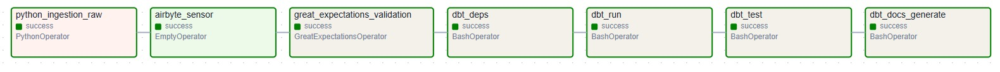
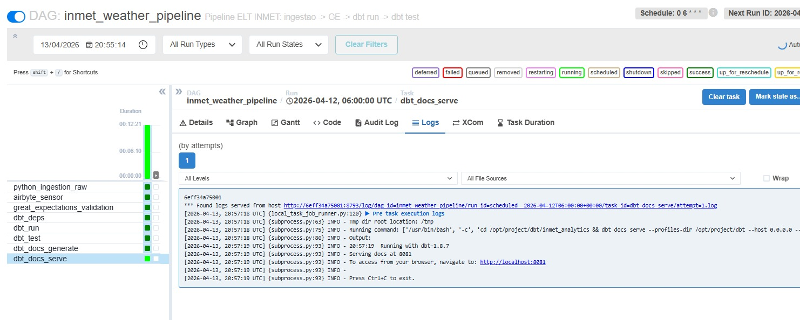
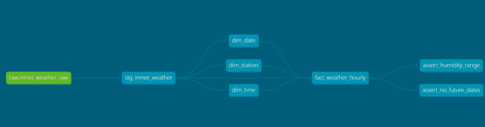
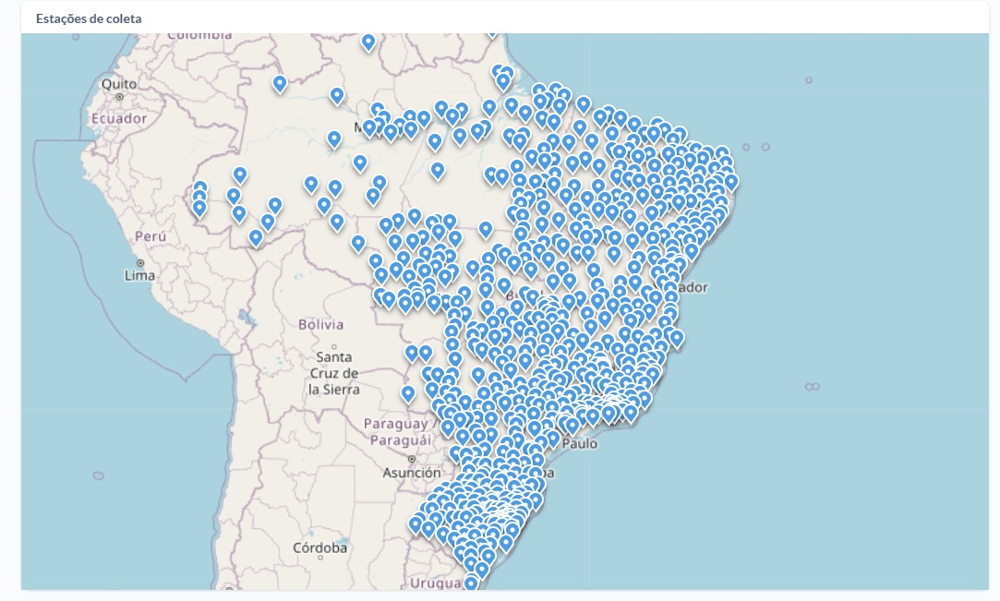
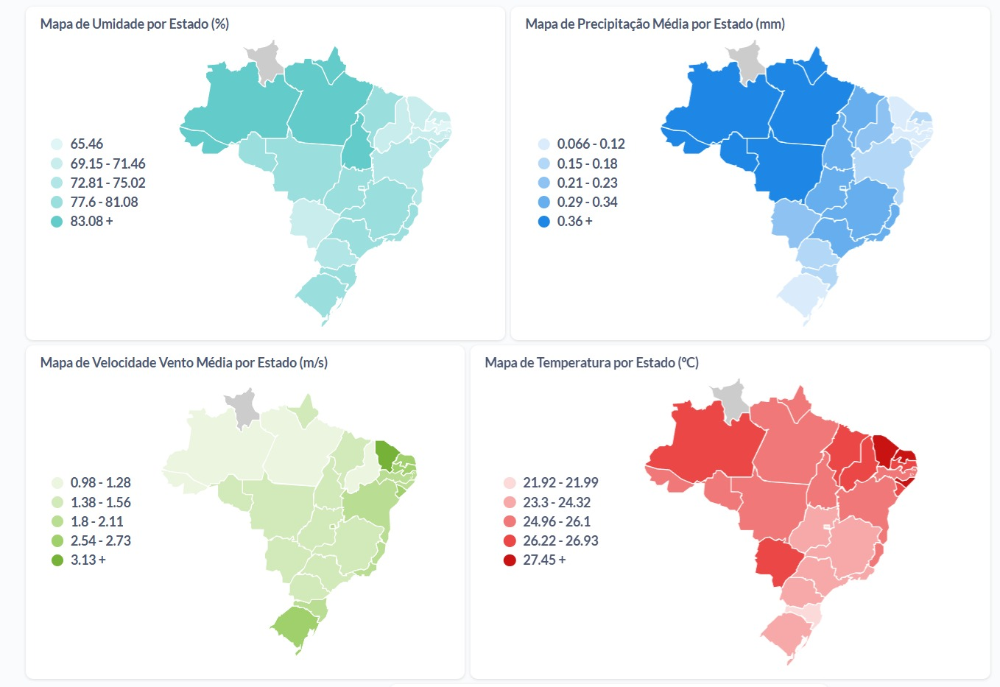
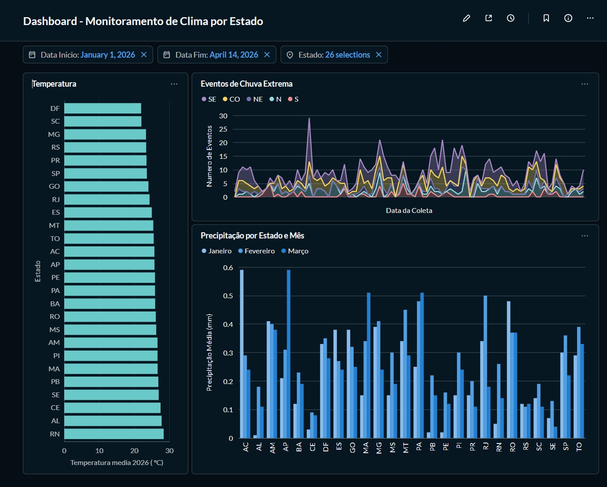

# Projeto Final - Fundamentos de Engenharia de Dados

Pipeline ELT completo com dados meteorológicos históricos do INMET, aplicado ao contexto agrícola.

---

## Sumário

1. [Contexto e Storytelling](#1-contexto-e-storytelling)
2. [Dataset](#2-dataset)
3. [Arquitetura](#3-arquitetura)
4. [Tecnologias utilizadas](#4-tecnologias-utilizadas)
5. [Estrutura do repositório](#5-estrutura-do-repositório)
6. [Pré-requisitos](#6-pré-requisitos)
7. [Passo a passo para executar](#7-passo-a-passo-para-executar)
8. [Modelagem dbt](#8-modelagem-dbt)
9. [Validação com Great Expectations](#9-validação-com-great-expectations)
10. [Dashboards no Metabase](#10-dashboards-no-metabase)
11. [Solução de problemas comuns](#11-solução-de-problemas-comuns)
12. [Referências](#12-referências)

---

## 1. Contexto e Storytelling

**Domínio:** Clima com aplicação agrícola

Uma cooperativa agrícola que atua em diferentes regiões do Brasil precisa tomar decisões operacionais diárias com base em dados climáticos confiáveis. A equipe de agronomia e operações depende de um painel atualizado para responder perguntas como:

- Quais regiões e estações registraram maior volume de chuva em determinado período?
- Como temperatura e umidade evoluíram ao longo do tempo por estado?
- Quais localidades registraram eventos de chuva intensa ou rajadas de vento que afetam operações de campo, como pulverização, colheita ou plantio?

O pipeline consome dados das estações meteorológicas automáticas do INMET (Instituto Nacional de Meteorologia) e os transforma em um modelo analítico pronto para consulta, com validação de qualidade em todas as camadas.

---

## 2. Dataset

- **Fonte oficial:** https://portal.inmet.gov.br/dadoshistoricos
- **Formato:** arquivos ZIP anuais contendo CSVs por estação meteorológica
- **URL de download usada pelo pipeline:** `https://portal.inmet.gov.br/uploads/dadoshistoricos/{ano}.zip`
- **Cobertura:** estações automáticas distribuídas por todos os estados do Brasil
- **Granularidade:** leituras horárias por estação (temperatura, umidade, precipitação, vento, pressão atmosférica)
- **Nota:** o dataset não é versionado no repositório por conta do volume. O script de ingestão faz o download automaticamente a partir da URL oficial.

---

## 3. Arquitetura

```
INMET (ZIP/CSV)
      |
      v
Python Ingestion Script
      |
      v
PostgreSQL - schema raw
(raw.inmet_weather_raw)
      |
      v
Great Expectations
(validação da camada raw)
      |
      v
dbt - schema silver
(stg_inmet_weather)
      |
      v
dbt - schema gold
(modelo estrela)
  dim_station
  dim_date
  dim_time
  fact_weather_hourly
      |
      v
Metabase Dashboards

[ Airflow DAG orquestra todo o fluxo acima ]
[ Docker garante reprodutibilidade do ambiente ]
```

---

## 4. Tecnologias utilizadas

| Tecnologia | Versão | Papel no pipeline |
|---|---|---|
| Python | 3.11 | Script de ingestão (download, parse e carga no PostgreSQL) |
| PostgreSQL | 16 | Banco principal com arquitetura medalhão (raw / silver / gold) |
| Great Expectations | 0.18.22 | Validação de qualidade dos dados na camada raw |
| dbt-postgres | 1.8.2 | Transformação raw -> silver -> gold, testes e documentação |
| Apache Airflow | 2.9.3 | Orquestração do pipeline com dependências e tratamento de falhas |
| Metabase | v0.50.13 | Dashboards conectados ao schema gold |
| Docker / Docker Compose | v2 | Containerização e reprodutibilidade do ambiente |

**Fluxo de execução da DAG (Airflow):**

```
python_ingestion_raw
      |
      v
airbyte_sensor  (placeholder de dependência)
      |
      v
great_expectations_validation
      |
      v
dbt_deps -> dbt_run -> dbt_test -> dbt_docs_generate
```

---

## 5. Estrutura do repositório

```
PROJETOFINAL_Grupo1/
├── airflow/
│   ├── Dockerfile  # Imagem customizada com dbt e GE pré-instalados
│   ├── requirements-airflow.txt
│   └── dags/
│       └── inmet_weather_pipeline.py  # DAG principal do pipeline
├── dashboards/
│   └── dashboard_queries.sql  # Queries base para os dashboards no Metabase
├── dbt/
│   ├── profiles.yml  # Configuração de conexão com o PostgreSQL
│   └── inmet_analytics/
│       ├── dbt_project.yml
│       ├── packages.yml
│       ├── macros/
│       │   ├── generate_schema_name.sql            # Controla schemas silver/gold
│       │   ├── precipitation_intensity_bucket.sql  # Classifica intensidade de chuva
│       │   ├── uf_to_timezone.sql                  # Converte UF para timezone brasileiro
│       │   └── wind_risk_level.sql                 # Classifica risco operacional de vento
│       ├── models/
│       │   ├── schema.yml
│       │   ├── staging/
│       │   │   └── stg_inmet_weather.sql  # Camada silver
│       │   └── marts/
│       │       ├── dim_date.sql
│       │       ├── dim_station.sql
│       │       ├── dim_time.sql
│       │       └── fact_weather_hourly.sql  # Fato principal
│       └── tests/
│           ├── assert_humidity_range.sql   # Teste singular: umidade fora de faixa
│           └── assert_no_future_dates.sql  # Teste singular: datas futuras
├── docs/
│   ├── checklist_requisitos.md
│   ├── setup_guide.md
│   └── screenshots/  # Capturas de tela para evidências de entrega
├── great_expectations/
│   ├── great_expectations.yml
│   ├── run_checkpoint.py  # Script de validação executável via CLI ou Airflow
│   ├── checkpoints/
│   │   └── raw_inmet_weather_checkpoint.yml
│   └── expectations/
│       └── raw_inmet_weather_suite.json
├── ingestion/
│   ├── Dockerfile
│   ├── ingest_inmet.py  # Script de extração e carga (EL)
│   └── requirements.txt
├── sql/init/
│   ├── 00_create_databases.sql  # Cria bancos e usuários no PostgreSQL
│   └── 01_schemas.sql           # Cria schemas raw/silver/gold e permissões
├── .env.example  # Variáveis de ambiente (copiar para .env)
├── .gitignore
├── docker-compose.yml
├── requirements.txt  # Dependências para execução local (sem Docker)
└── README.md
```

---

## 6. Pré-requisitos

A única dependência necessária na máquina local é o Docker. Não é preciso instalar Python, dbt, Airflow ou qualquer outra ferramenta separadamente.

### Windows

1. Instale o **Docker Desktop**: https://www.docker.com/products/docker-desktop
   - Habilite o backend WSL2 quando solicitado (recomendado)
2. Instale o **Git**: https://git-scm.com/download/win

### Linux (Ubuntu / Debian)

```bash
# Docker Engine
curl -fsSL https://get.docker.com | sh
sudo usermod -aG docker $USER
newgrp docker

# Verificar instalação
docker compose version

# Git
sudo apt-get install -y git
```

### macOS

```bash
brew install --cask docker
brew install git
```

---

## 7. Passo a passo para executar

### 7.1 Clonar o repositório

```bash
git clone <URL_DO_REPOSITORIO>
cd PROJETOFINAL_Grupo1
```

### 7.2 Configurar variáveis de ambiente

```bash
cp .env.example .env
```

O arquivo `.env.example` já possui valores padrão funcionais para execução local. Edite o `.env` apenas se quiser personalizar senhas, portas ou os anos de ingestão:

| Variável | Padrão | Descrição |
|---|---|---|
| `POSTGRES_USER` | `inmet_user` | Usuário principal do PostgreSQL |
| `POSTGRES_PASSWORD` | `inmet_pass` | Senha do usuário principal |
| `POSTGRES_DB` | `inmet_db` | Banco de dados principal |
| `ANALYTICS_USER` | `analytics_user` | Usuário usado pelo dbt e Metabase |
| `ANALYTICS_PASSWORD` | `analytics_pass` | Senha do analytics_user |
| `AIRFLOW_USER` | `admin` | Login da interface do Airflow |
| `AIRFLOW_PASSWORD` | `admin` | Senha da interface do Airflow |
| `INMET_YEARS` | `2026` | Anos a ingerir, separados por vírgula (ex: `2026`) |
| `LOAD_MODE` | `full_refresh` | Modo de carga: `full_refresh` ou `incremental` |
| `AIRFLOW_PORT` | `8080` | Porta local do Airflow |
| `METABASE_PORT` | `3001` | Porta local do Metabase |
| `DBT_DOCS_PORT` | `8081` | Porta local da documentação dbt |

> Se alguma porta já estiver em uso na sua máquina, altere o valor correspondente no `.env` antes de subir os containers.

### 7.3 Subir o ambiente

```bash
docker compose up -d --build
```

Na primeira execução, o Docker vai baixar as imagens base e construir a imagem customizada do Airflow. Isso pode levar de 3 a 5 minutos dependendo da conexão.

### 7.4 Verificar se todos os containers estão rodando

```bash
docker compose ps
```

O resultado esperado é:

```
inmet-postgres              running (healthy)
inmet-airflow-init          exited (0)          <- normal, executa uma vez e encerra
inmet-airflow-webserver     running (healthy)
inmet-airflow-scheduler     running
inmet-dbt-docs              running
inmet-metabase              running
```

Se o `airflow-webserver` demorar para ficar `healthy`, aguarde mais 1 ou 2 minutos e rode `docker compose ps` novamente.

### 7.5 Executar a ingestão inicial dos dados

O script de ingestão faz o download dos arquivos ZIP do INMET, extrai os CSVs e carrega os dados na tabela `raw.inmet_weather_raw`. Essa etapa pode ser executada de duas formas:

**Opção A - via container isolado (recomendado para a primeira carga):**

```bash
docker compose --profile bootstrap up inmet-ingestion
```

Aguarde o container encerrar com sucesso antes de prosseguir. O log deve finalizar com:

```
[OK] Total de linhas carregadas: XXXXXXX
```

**Opção B - via Airflow:** a tarefa `python_ingestion_raw` executa a ingestão automaticamente quando a DAG é disparada (passo 7.6).

### 7.6 Executar o pipeline no Airflow

1. Acesse http://localhost:8080 (ou a porta configurada em `AIRFLOW_PORT`)
2. Login: `admin` / `admin`
3. Localize a DAG `inmet_weather_pipeline`
4. Ative o toggle para habilitar a DAG
5. Clique no botão de execução manual (Trigger DAG)

A DAG vai executar as tarefas na seguinte ordem:

```
python_ingestion_raw  ->  airbyte_sensor  ->  great_expectations_validation
      ->  dbt_deps  ->  dbt_run  ->  dbt_test  ->  dbt_docs_generate
```

Cada tarefa deve aparecer em verde ao completar. Em caso de falha, o Airflow tenta novamente automaticamente (2 retentativas com intervalo de 5 minutos).

**Captura de tela da execução da DAG:**





### 7.7 Verificar o relatório do Great Expectations

Após a tarefa `great_expectations_validation` completar:

```bash
cat great_expectations/uncommitted/validation_results/raw_inmet_weather_checkpoint.json
```

O campo `"success": true` confirma que os dados passaram em todas as expectativas configuradas.

**Captura de tela do relatório de validação:**

<!-- placeholder imagem Great Expectations 

-->

### 7.8 Verificar a documentação e linhagem do dbt

Acesse http://localhost:8081 para visualizar o lineage graph e as descrições de todos os modelos, testes e fontes.

**Captura de tela do lineage graph:**



### 7.9 Configurar o Metabase

1. Acesse http://localhost:3001 (ou a porta configurada em `METABASE_PORT`)
2. Siga o wizard de configuração inicial do Metabase
3. Adicione a conexão com o banco de dados:
   - **Tipo:** PostgreSQL
   - **Host:** `postgres`
   - **Porta:** `5432`
   - **Banco de dados:** `inmet_db`
   - **Usuário:** `analytics_user`
   - **Senha:** `analytics_pass`
4. Crie os dashboards usando as queries disponíveis em `dashboards/dashboard_queries.sql`

**Captura de tela dos dashboards:**

Mapa de Estações de Coleta


Mapas de Umidade, Precipitação, Vento e Temperatura por Estado


Dashboard - Monitoramento de Clima por Estado


### 7.10 Parar o ambiente

```bash
# Para os containers sem apagar os dados
docker compose down

# Para os containers e remove todos os volumes (apaga dados do Postgres e Metabase)
docker compose down -v
```

---

### Execução local sem Docker (opcional, para desenvolvimento)

Se preferir rodar os componentes diretamente na sua máquina:

```bash
# Criar e ativar ambiente virtual
python -m venv .venv
source .venv/bin/activate       # Linux / macOS
.venv\Scripts\activate          # Windows

# Instalar dependências
pip install -r requirements.txt

# Ingestão
python ingestion/ingest_inmet.py

# Validação Great Expectations
python great_expectations/run_checkpoint.py

# dbt
cd dbt/inmet_analytics
dbt deps --profiles-dir ../
dbt run --profiles-dir ../
dbt test --profiles-dir ../
dbt docs generate --profiles-dir ../
dbt docs serve --profiles-dir ../
```

Certifique-se de que as variáveis de ambiente do `.env` estejam exportadas na sessão antes de executar os scripts.

---

## 8. Modelagem dbt

### Camada Silver - `stg_inmet_weather`

Modelo de staging que padroniza os dados brutos da camada raw:

- Normalização de nomes de colunas e tipos de dados
- Conversão de valores numéricos com vírgula decimal para ponto
- Tratamento de strings vazias e valores `NULL` textuais
- Conversão do timestamp UTC para horário local de cada estado via macro `uf_to_timezone`
- Filtragem de linhas sem data válida

### Camada Gold - modelo estrela

| Tabela | Tipo | Descrição |
|---|---|---|
| `dim_station` | Dimensão | Estações meteorológicas WMO com localização geográfica (lat/lon, UF, região) |
| `dim_date` | Dimensão | Calendário com ano, mês, dia, nome do dia da semana e ano-mês |
| `dim_time` | Dimensão | Horário com hora inteira e classificação de período do dia |
| `fact_weather_hourly` | Fato | Observações horárias com métricas de clima e classificações de risco |

Todas as chaves substitutas (surrogate keys) são geradas com `dbt_utils.generate_surrogate_key`.

### Macros customizadas

| Macro | Descrição |
|---|---|
| `precipitation_intensity_bucket` | Classifica precipitação em sem_dado, sem_chuva, chuva_fraca, chuva_moderada ou chuva_intensa |
| `wind_risk_level` | Classifica rajada de vento em sem_dado, vento_fraco, vento_moderado, vento_forte ou vento_tempestade |
| `uf_to_timezone` | Mapeia sigla de UF para o timezone IANA correspondente (ex: SP -> America/Sao_Paulo) |
| `generate_schema_name` | Garante que os modelos sejam criados nos schemas silver e gold sem prefixo do projeto |

### Testes

**Testes genéricos** (definidos em `schema.yml`):
- `unique` e `not_null` nas surrogate keys e identificadores naturais
- `not_null` em colunas obrigatórias de data e hora
- `accepted_values` em colunas categóricas: `mes`, `hora_int`, `periodo_dia`, `intensidade_chuva` e `risco_vento`

**Testes singulares** (em `dbt/inmet_analytics/tests/`):
- `assert_no_future_dates.sql`: verifica se existem registros com data posterior à data atual na tabela fato
- `assert_humidity_range.sql`: verifica se existem registros com umidade fora da faixa física válida (0 a 100)

---

## 9. Validação com Great Expectations

A suite `raw_inmet_weather_suite` é aplicada exclusivamente sobre a camada raw, antes de qualquer transformação. Ela contém 16 expectativas organizadas em quatro grupos:

**Existência de colunas obrigatórias (10 expectativas):**
`data`, `hora_referencia`, `meta_codigo_wmo`, `temperatura_do_ar_bulbo_seco_horaria`, `umidade_relativa_do_ar_horaria`, `precipitacao_total_horario`, `vento_velocidade_horaria`, `vento_direcao_horaria_graus`, `vento_rajada_maxima_horaria`, `pressao_atmosferica_ao_nivel_da_estacao_horaria`

**Valores não nulos (2 expectativas):**
`data` e `meta_codigo_wmo` não podem ter valores nulos

**Faixas de valores (3 expectativas):**
- Umidade entre 0 e 100 (com tolerância de 2%)
- Temperatura entre -20 e 55 graus Celsius (com tolerância de 2%)
- Precipitação não negativa (com tolerância de 0.1%)

**Sanidade de volume (1 expectativa):**
- Contagem de linhas entre 1.000.000 e 10.000.000 (detecta downloads truncados ou duplicações massivas)

O checkpoint pode ser executado via CLI ou pela task `great_expectations_validation` da DAG:

```bash
python great_expectations/run_checkpoint.py
```

---

## 10. Dashboards no Metabase

Os dashboards respondem diretamente às perguntas de negócio do storytelling. As queries base estão em `dashboards/dashboard_queries.sql`.

**Dashboard 1 - Volume de chuva por estação e mês**

Agrupa a precipitação total por região, UF e estação meteorológica. Permite identificar as regiões mais chuvosas e planejar janelas seguras para operações de campo.

**Dashboard 2 - Temperatura e umidade médias por dia**

Exibe a evolução diária de temperatura e umidade por estado. Útil para monitorar condições ideais de pulverização e irrigação.

**Dashboard 3 - Eventos de chuva intensa por região**

Conta os eventos classificados como `chuva_intensa` por dia e região. Funciona como alerta operacional para orientar a suspensão de atividades de campo em situações de risco climático.

---

## 11. Solução de problemas comuns

**Porta já em uso**

```
Error: ports are not available: exposing port TCP 0.0.0.0:8080
```

Edite as variáveis de porta no `.env` e suba novamente:

```bash
# exemplo: trocar porta do Airflow
AIRFLOW_PORT=8082
```

```bash
docker compose up -d
```

**Airflow não conecta no PostgreSQL**

Verifique se o container `airflow-init` encerrou com código 0:

```bash
docker compose logs airflow-init
```

Se houver erro de banco não encontrado, recrie os volumes:

```bash
docker compose down -v
docker compose up -d --build
```

**Falha no download dos dados do INMET**

Verifique a conectividade com o portal:

```bash
curl -I https://portal.inmet.gov.br/uploads/dadoshistoricos/2026.zip
```

Se a URL mudou, atualize `INMET_BASE_URL` no `.env`.

**dbt falha com `relation "raw.inmet_weather_raw" does not exist`**

A ingestão precisa ter rodado antes do dbt. Certifique-se de que a tarefa `python_ingestion_raw` foi executada com sucesso no Airflow antes de `dbt_run`, ou rode a ingestão manualmente pelo passo 7.5.

**Metabase perde dashboards após reiniciar**

Isso não deve acontecer nessa configuração. O banco de metadados do Metabase está armazenado no PostgreSQL (`metabase_db`), que persiste no volume `postgres-data/`. Evite usar `docker compose down -v` em ambiente de desenvolvimento contínuo.

**dbt docs não carrega logo após subir o ambiente**

O container `dbt-docs` executa `dbt docs generate` toda vez que inicializa. Aguarde cerca de 1 minuto após o container subir antes de acessar http://localhost:8081.

---

## 12. Referências

- Dataset INMET: https://portal.inmet.gov.br/dadoshistoricos
- GeoJSON dos estados brasileiros: https://github.com/giuliano-macedo/geodata-br-states

## 13. Opcional

### 13.1 Provisionamento de infraestrutura na Azure com Terraform

O diretório terraform/azure-postgres/ provisiona um PostgreSQL Flexible Server na Azure (usado como alternativa ao Postgres local em ambientes de cloud).

Pré-requisitos:

Terraform >= 1.5.0

Azure CLI

#### 1. Verificar e instalar o Azure CLI

Para verificar se esta instalado, use o seguinte comando:

az version

Caso nao seja encontrado, baixe no seu Sistema Operacional:

macOS: https://docs.microsoft.com/pt-br/cli/azure/install-azure-cli-macos?view=azure-cli-latest
Windows: https://docs.microsoft.com/pt-br/cli/azure/install-azure-cli-windows?view=azure-cli-latest
Linux: https://docs.microsoft.com/pt-br/cli/azure/install-azure-cli-linux?view=azure-cli-latest

Feito isso, autentique-se na Azure no terminal usando:

az login

Um navegador vai aparecer para voce se autenticar, insira seu login e senha e depois volte ao terminal

Apos isso, entre na pasta do terraform/azure/ e execute o comando:

terraform init

Ele vai instalar todas as dependencias necessarias para rodar o terraform

Apos isso, edite o arquivo terraform.tfvars.example, renomeie-o para terraform.tfvars e preencha as variaveis

Depois rode o comando:

terraform plan

Isso vai mostrar o que vai ser criado dentro da Azure, se tudo estiver ok, rode o comando:

terraform apply

Quando terminar de usar, rode o seguinte comando:

terraform destroy

Isso vai destruir tudo que foi criado dentro da Azure