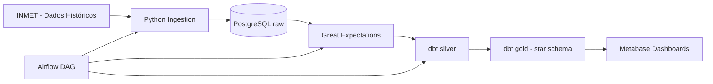

# Projeto Final - Fundamentos de Engenharia de Dados

Pipeline ELT completo usando dados históricos de estações automáticas do INMET.

## 1) Storytelling (Domínio: Clima - Agro)

Uma cooperativa agrícola precisa planejar irrigação, manejo de solo e alertas de risco climático por região. O time de operações precisa de um painel diário confiável para responder:

1. Quais estações e regiões registraram maior volume de chuva por período?
2. Como temperatura e umidade evoluem ao longo do tempo por estado/estação?
3. Quais localidades tiveram eventos de chuva intensa que impactam operação de campo?

## 2) Dataset escolhido

- Fonte oficial: https://portal.inmet.gov.br/dadoshistoricos
- Tipo: dados históricos anuais de estações automáticas (arquivos ZIP com CSVs)
- Exemplo de URL utilizada pelo pipeline: `https://portal.inmet.gov.br/uploads/dadoshistoricos/2024.zip`

## 3) Arquitetura



## 4) Estrutura do repositório

- `docker-compose.yml`
- `sql/init/`: criação de schemas medalhão (`raw`, `silver`, `gold`)
- `ingestion/`: script Python de ingestão e Dockerfile
- `great_expectations/`: suíte, checkpoint e execução de validação
- `dbt/`: projeto dbt com staging, dimensões, fato, macro e testes
- `airflow/dags/`: DAG de orquestração ponta a ponta
- `dashboards/`: queries para montar os dashboards no Metabase
- `docs/`: documentação complementar exigida

## 5) Como executar

### 5.1 Pré-requisitos

- Docker + Docker Compose
- (Opcional) Git

### 5.2 Inicialização

```bash
cp .env.example .env
docker compose up -d --build
```

Serviços principais:

- Airflow: http://localhost:8080 (`admin` / `admin`)
- Metabase: http://localhost:3000
- PostgreSQL: `localhost:5432`

### 5.3 Execução do pipeline

1. No Airflow, execute a DAG `inmet_weather_pipeline`.
2. Ordem das tasks:
   - `python_ingestion_raw`
   - `airbyte_sensor` (placeholder de dependência)
   - `great_expectations_validation`
   - `dbt_deps`
   - `dbt_run`
   - `dbt_test`
   - `dbt_docs_generate`

### 5.4 Execução manual (opcional)

```bash
# Ingestão
python ingestion/ingest_inmet.py

# Validação
python great_expectations/run_checkpoint.py

# dbt
cd dbt/inmet_analytics
dbt deps
dbt run --profiles-dir ../
dbt test --profiles-dir ../
dbt docs generate --profiles-dir ../
```

### 5.5
### Para parar os containers

```bash
docker compose down        # para e remove containers, mantém volumes
docker compose down -v     # para, remove containers E volumes (apaga dados do banco e do Grafana)
```

## 6) Modelagem (dbt)

### Camada silver

- `silver.stg_inmet_weather`: tipagem e padronização das colunas da raw.

### Camada gold

- `gold.dim_station`
- `gold.dim_date`
- `gold.fact_weather_hourly`

Requisitos atendidos no dbt:

- `stg_*`, `dim_*`, `fact_*`
- surrogate keys com `dbt_utils.generate_surrogate_key`
- macro customizada: `precipitation_intensity_bucket`
- testes genéricos (`unique`, `not_null`, `accepted_values`)
- 2 testes singulares em `dbt/inmet_analytics/tests/`

## 7) Great Expectations

Suíte aplicada na camada `raw` com expectativas mínimas:

- `expect_column_values_to_not_be_null` em `data`
- `expect_column_values_to_be_between` para umidade (0-100)
- `expect_column_values_to_not_be_null` em `meta_codigo_wmo`

Checkpoint: `raw_inmet_weather_checkpoint`

## 8) Dashboards (Metabase)

Arquivo base: `dashboards/dashboard_queries.sql`

- Dashboard 1: Monitor de precipitação por estação/região
- Dashboard 2: Tendência de temperatura e umidade no tempo

## 9) Evidências para entrega final

Para fechar a entrega acadêmica, incluir no repositório final:

1. Capturas dos dashboards em funcionamento
2. Captura do relatório de validação GE
3. Captura da linhagem do dbt docs
4. Vídeo de demonstração (até 7 min)

## 10) Observações

- O projeto utiliza ingestão via script Python (alternativa oficial ao Airbyte no enunciado).
- O serviço `airbyte-placeholder` foi deixado no `docker-compose` para evolução futura, caso o grupo deseje adicionar sincronização real com Airbyte.
